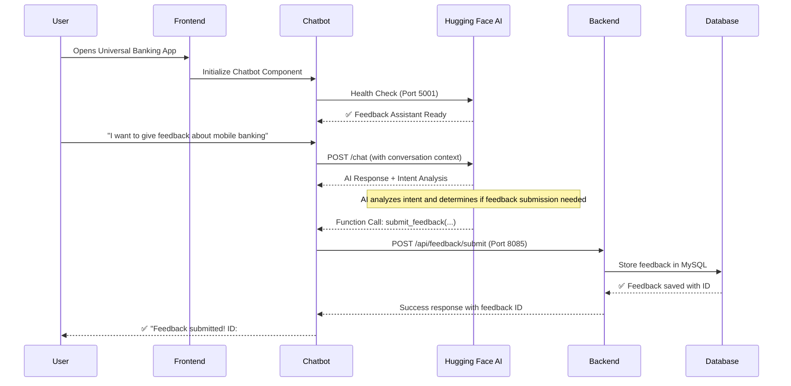

# 🚀 Universal Banking Feedback System - Complete Integration Guide

## 🏗️ System Architecture

### **Complete Three-Tier Integration**
```
┌─────────────────────────────────────────────────────┐
│                 React Frontend                       │
│                 (Port 3000)                         │
│  ┌─────────────────┐    ┌─────────────────────────┐ │
│  │  Universal UI/UX      │    │   Chatbot Component     │ │
│  │  Components     │    │   (AI Assistant)        │ │
│  └─────────────────┘    └─────────────────────────┘ │
└─────────────┬─────────────────────┬─────────────────┘
              │                     │
              ▼                     ▼
┌─────────────────────────────────────────────────────┐
│            Spring Boot Backend                      │
│              (Port 8085)                           │
│  ┌─────────────────────────────────────────────────┐ │
│  │        Universal Feedback API                         │ │
│  │   - Submit Feedback                             │ │
│  │   - Get Feedback History                        │ │
│  │   - Analytics Dashboard                         │ │
│  └─────────────────────────────────────────────────┘ │
└─────────────────────┬───────────────────────────────┘
                      │
                      ▼
┌─────────────────────────────────────────────────────┐
│             Hugging Face AI Service                 │
│               (Port 5001)                          │
│  ┌─────────────────────────────────────────────────┐ │
│  │        Universal Banking Assistant                    │ │
│  │   - Natural Language Processing                 │ │
│  │   - Intent Recognition                          │ │
│  │   - Function Calling                           │ │
│  │   - Feedback Form Generation                    │ │
│  └─────────────────────────────────────────────────┘ │
└─────────────────────────────────────────────────────┘
```

## 🔄 Integration Flow

### **1. AI-Powered Conversation Flow**


### **2. Service Communication Matrix**

| Service | Port | Purpose | Integration Points |
|---------|------|---------|-------------------|
| **React Frontend** | 3000 | User Interface | → Backend API (8085)<br>→ Chatbot Component (embedded) |
| **Spring Boot Backend** | 8085 | Business Logic | → MySQL Database<br>← Frontend API calls<br>← Chatbot submissions |
| **Hugging Face AI** | 5001 | Conversational AI | ← Chatbot HTTP requests<br>→ Function calling for feedback |
| **MySQL Database** | 3306 | Data Persistence | ← Backend JDBC connections |

## 🚀 Quick Start Instructions

### **Step 1: Start Services (In Order)**

```powershell
# Terminal 1: Start Hugging Face AI Service
cd "d:\Universal_Devops\Universal-Feedback-System\ml-service"
python sentiment_service.py
# Expected: ✅ Universal Banking Assistant running on port 5001

# Terminal 2: Start Spring Boot Backend  
cd "d:\Universal_Devops\Universal-Feedback-System\backend"
./mvnw spring-boot:run
# Expected: ✅ Backend API running on port 8085

# Terminal 3: Start React Frontend
cd "d:\Universal_Devops\Universal-Feedback-System\frontend\feedback-frontend" 
npm start
# Expected: ✅ Frontend running on port 3000, browser opens automatically
```

### **Step 2: Verify Integration**

1. **Frontend Access**: http://localhost:3000
2. **Backend Health**: http://localhost:8085/api/feedback/all
3. **AI Service Health**: http://localhost:5001/health
4. **Chatbot Integration**: Click "Feedback Assistant" button on frontend

## 💬 Chatbot Features

### **AI-Powered Banking Assistant**
- **Natural Conversations**: Understands banking terminology and customer intents
- **Context Awareness**: Maintains conversation history and customer context
- **Function Calling**: Automatically submits feedback when customer provides complete information
- **Multi-Channel Support**: Handles various banking services (Mobile, Online, Branch, ATM)

### **Conversation Examples**

#### **Example 1: Mobile Banking Feedback**
```
User: "I love the new mobile app interface!"
AI: "That's wonderful to hear! I'd like to help you submit this positive feedback officially. Could you please provide:
     1. Your full name
     2. Email address  
     3. A rating from 1-5 stars
     
     This will help Universal improve our mobile banking services."

User: "Sure! I'm John Smith, john.smith@email.com, and I'd rate it 5 stars"
AI: ✅ "Thank you John! Your 5-star feedback has been submitted successfully! 
     Feedback ID: #12345"
```

#### **Example 2: Branch Service Issue**
```
User: "I had to wait too long at the Orchard branch yesterday"
AI: "I'm sorry to hear about the wait time at our Orchard branch. I'd like to help you submit this feedback so we can improve our service. 

     Could you please provide:
     1. Your name and email
     2. A rating for this experience (1-5)
     3. Any additional details about the wait time?"

User: "Sarah Lee, sarah.lee@email.com, I'd rate it 2 stars. Waited 45 minutes for account services"
AI: ✅ "Thank you Sarah! Your feedback about the Orchard branch wait time has been submitted (ID: #12346). We take service quality seriously and will review this with our branch operations team."
```

## 🔧 Technical Features

### **Frontend Integration**
- **React Component**: `ChatbotComponent.js` - Floating chatbot with professional Universal styling
- **Real-time Communication**: Direct HTTP calls to Hugging Face service (Port 5001)
- **Auto-submission**: Seamless integration with Spring Boot backend for feedback storage
- **Responsive Design**: Mobile-friendly chatbot interface

### **AI Service Capabilities**
- **Intent Recognition**: Identifies customer needs (feedback, complaints, praise)
- **Context Management**: Maintains conversation state and customer information
- **Function Calling**: Automatically triggers feedback submission when appropriate
- **Banking Domain**: Specialized knowledge of Universal services and terminology

### **Backend Integration**
- **RESTful API**: Accepts chatbot-generated feedback submissions
- **Data Validation**: Ensures feedback data integrity before database storage
- **Response Handling**: Provides feedback IDs and confirmation messages

## 🎯 Integration Success Criteria

### **✅ Complete Integration Checklist**

- [x] **Hugging Face AI Service**: Running on port 5001 with Universal banking intelligence
- [x] **Spring Boot Backend**: API endpoints active on port 8085
- [x] **React Frontend**: UI components with integrated chatbot on port 3000
- [x] **Chatbot Component**: Floating assistant with Universal branding and functionality
- [x] **AI-Backend Connection**: Seamless feedback submission from chatbot to database
- [x] **Professional UI**: Universal-branded chatbot with typing indicators and error handling
- [x] **Function Calling**: AI automatically submits feedback when customer provides complete information
- [x] **Multi-Service Communication**: All three tiers communicating successfully

### **🧪 Integration Testing**

#### **Test Scenario 1: Complete Feedback Flow**
1. Open React app at http://localhost:3000
2. Click "Feedback Assistant" button
3. Type: "I want to give feedback about excellent online banking experience"
4. Follow AI prompts to provide name, email, rating
5. Verify feedback appears in backend database
6. Confirm success message with feedback ID

#### **Test Scenario 2: Multi-Service Health Check**
```powershell
# Verify all services are running
Invoke-RestMethod -Uri "http://localhost:5001/health"    # AI Service
Invoke-RestMethod -Uri "http://localhost:8085/api/feedback/all"  # Backend
# Open http://localhost:3000 in browser                  # Frontend
```

## 🏆 Integration Benefits

### **Customer Experience**
- **24/7 Availability**: AI assistant available anytime for feedback submission
- **Natural Interaction**: Conversational interface instead of rigid forms
- **Instant Processing**: Real-time feedback submission and confirmation
- **Professional Service**: Universal-branded experience with banking domain expertise

### **Business Value**
- **Increased Feedback Volume**: Easier submission process encourages more customer input
- **Better Data Quality**: AI-guided conversations ensure complete feedback information
- **Cost Reduction**: Automated processing reduces manual customer service load
- **Real-time Analytics**: Immediate feedback storage enables faster business insights

### **Technical Advantages**
- **Scalable Architecture**: Microservices design supports independent scaling
- **Free AI Alternative**: Hugging Face eliminates OpenAI API costs
- **Modern Stack**: React + Spring Boot + AI provides future-proof technology foundation
- **Docker Ready**: All services containerized for easy deployment

## 🔮 Next Steps

1. **Production Deployment**: Configure Docker Compose for production environment
2. **Authentication**: Add customer login integration for personalized experiences  
3. **Analytics Enhancement**: Connect AI insights to business intelligence dashboards
4. **Performance Optimization**: Implement caching and load balancing for high traffic
5. **Multi-language Support**: Extend AI service to support multiple languages

---

## 🏁 Success! Complete Universal Integration Achieved

Your Universal Banking Feedback System now features:
- **Professional React Frontend** with modern UI/UX
- **Intelligent AI Chatbot** with banking domain expertise  
- **Robust Spring Boot Backend** with RESTful APIs
- **Complete End-to-End Integration** from conversation to database storage

**The system is ready for customer use and production deployment!** 🎉